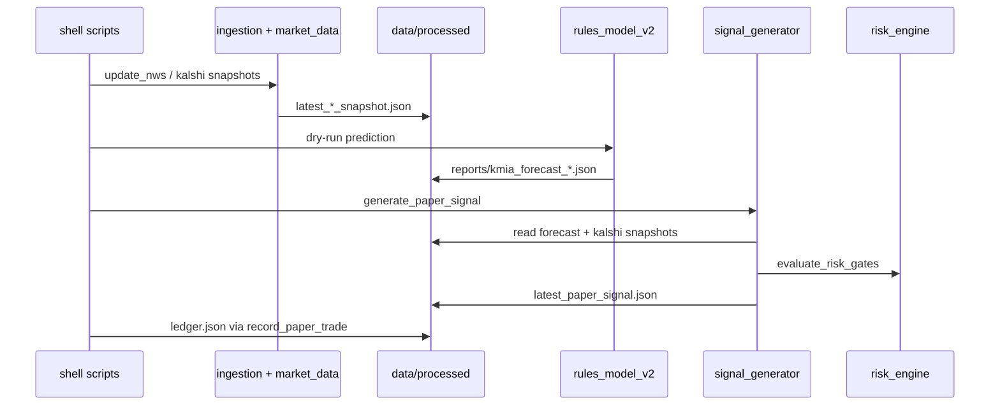

# Refactoring Deep Dive — KMIA Kalshi Predictor

**Audience:** Engineers preparing structural refactors  
**Date:** 2026-05-19  
**Companion:** [REFACTORING_PLAN.md](REFACTORING_PLAN.md) (execution checklist)

---

## 1. Executive summary

This codebase is a **research MVP** for KMIA daily-max temperature bins on Kalshi-style markets. It is **not** a trading execution system. Strengths: clear safety posture, hard impossible-bin constraints, rich paper-evaluation path, large test suite. Weaknesses: **parallel implementations** of the same concerns, **file-first ops** vs **optional SQLAlchemy**, and a **1,735-line Streamlit monolith**.

**Verdict**

| Area | Assessment |
|------|------------|
| Safe to refactor incrementally | Yes — tests pass; Phase 0 invariants started |
| Biggest risk if refactored carelessly | Split-brain paper ledger + dual edge math |
| Highest leverage refactor | Unify **ops pipeline** around one evaluation stack + `artifact_paths` |
| Defer until Phase 3 | `web_console.py` split (high churn, low core logic risk) |

---

## 2. What the program actually does (runtime truth)

### 2.1 Primary daily path (what runs in production)

`scripts/run_kmia_daily_workflow.sh` orchestrates:

1. Parse target dates from `latest_kalshi_market_snapshot.json`
2. **Dry-run** forecast per date (`run_daily_prediction.sh --dry-run --model rules_v2_climatology`)
3. Model comparison dry-run (v1 vs v2, today only)
4. Settlement check (`settle_yesterday.sh`)
5. Paper signal (`generate_paper_signal.sh` → `signal_generator.py`)
6. Weekly calibration aggregate
7. Record paper trade (`record_paper_trade.sh`)
8. Daily status (`scheduler.generate_daily_status`)

**Critical insight:** The live loop is **artifact-driven**, not DB-driven. Forecasts land in `backend/data/processed/reports/*.json`. The DB path in `run_daily_prediction.py` exists but is bypassed whenever `--dry-run` is used (which the workflow always does).

### 2.2 Secondary paths

| Path | Role | Wired to daily workflow? |
|------|------|--------------------------|
| `scheduler/jobs.py --loop` | Live obs refresh, midnight prediction, settlement | Optional daemon |
| `recommendation/recommender.py` | Bin-level TRADE_CANDIDATE / WATCH / REJECT | **No** — tests only |
| `llm/llm_reviewer.py` | Validates LLM JSON shape | **No** — tests only |
| SQLAlchemy `db/models.py` | Persistence for predictions, settlements | Partial / future |
| `web_console.py` | Operator UI | Manual (`run_web_console.sh`) |

### 2.3 Data flow (canonical ops)



---

## 3. Module map and ownership (target bounded contexts)

| Bounded context | Responsibility | Canonical modules | Retire / merge |
|-----------------|----------------|-------------------|----------------|
| **Contracts** | Bins, Pydantic schemas | `shared/types.py`, `shared/artifact_paths.py` | Local `REQUIRED_BINS` copies (done Phase 0) |
| **Ingestion** | Fetch + parse NWS/Kalshi raw | `ingestion/*`, `market_data/kalshi_public_client.py` | `kalshi/client.py`, thin `weather/nws_kmia_client` |
| **Forecasting** | Probability bins | `forecasting/rules_model_v2.py` (+ v1 for compare) | Inline feature dict in scheduler |
| **Calibration** | Scoring vs CLIMIA | `calibration/metrics.py`, `ingestion/climia_parser.py` | — |
| **Market mapping** | Kalshi ticker → bin | `market_data/kalshi_contract_mapper.py`, `kalshi/weather_market_mapper.py` | Overlap between `kalshi/` and `market_data/` |
| **Paper evaluation** | Signals, ledger, settlement | `paper_trading/signal_generator.py`, `paper_ledger.py` | `persistence.py`, `learning.py` JSONL paths |
| **Risk** | No-trade gates | `risk/risk_engine.py` | Duplicate gate logic in `recommendation/gates.py` |
| **Edge / EV** | Fee-aware edge | `trading/edge_engine.py` (ops) | `recommendation/ev.py` (test-only stack) |
| **Ops UI** | Streamlit console | `web_console.py` | Split in Phase 3 |
| **Persistence (optional)** | SQLAlchemy ORM | `db/models.py` | Rename to `*Record` to avoid name clash |

---

## 4. Duplication deep dives (how to merge safely)

### 4.1 Two Kalshi HTTP clients

| | `kalshi/client.py` | `market_data/kalshi_public_client.py` |
|--|-------------------|--------------------------------------|
| Base URL | `api.elections.kalshi.com` | `external-api.kalshi.com` (env override) |
| Auth | None | Optional RSA (GET only) |
| Retries | No | Yes (urllib3 Retry) |
| Discovery / snapshot save | No | Yes |
| Used by | `market_discovery.py`, tests | `update_kalshi_snapshots`, daily ops |

**Refactor approach**

1. Make `market_data.kalshi_public_client.KalshiPublicClient` the **only** client.
2. Add a thin compatibility shim in `kalshi/client.py` that re-exports and logs deprecation (one release cycle).
3. Point `market_discovery.py` at `market_data` and delete shim when tests green.
4. ADR: document which base URL is canonical for KMIA weather series.

### 4.2 Two edge / EV stacks

**Stack A — `recommendation/`** (legacy design)

- Prices in **cents** (`yes_ask` int → `/100`)
- `generate_recommendations()` with `Action.WATCH | TRADE_CANDIDATE | REJECT`
- Used in `test_ev_logic.py`, `test_full_pipeline_readonly.py` only

**Stack B — `trading/edge_engine.py` + `risk/`** (ops design)

- Prices in **probability** [0,1]
- `compute_edge()` returns rich dict (breakeven, fee_buffer, tradable flag)
- `signal_generator.py` calls `compute_edge` then `evaluate_risk_gates`

**Refactor approach**

1. Extract **`shared/edge.py`** (or `trading/pricing.py`) with one fee formula: `0.07 * p * (1-p)`.
2. Implement adapters:
   - `edge_from_cents(yes_ask_cents, model_prob)` for recommendation tests
   - `compute_edge(...)` stays as the rich ops API
3. Implement `recommendation/recommender.py` as a thin wrapper over shared edge + shared gates (or mark module `deprecated` and migrate tests to paper path).
4. **Do not** delete `recommendation/` until tests prove paper path covers the same gate semantics.

### 4.3 Three paper-ledger shapes

| File | Format | Writers | Readers |
|------|--------|---------|---------|
| `artifact_paths.PAPER_LEDGER_FILE` → `ledger.json` | Single JSON doc | `PaperLedger`, `ledger.py` | `web_console`, `risk_engine`, `record_paper_trade.sh` |
| `persistence.py` → `paper_trades.jsonl` | JSONL records | `save_recommendation` | Legacy tests |
| `learning.py` → `paper_trade_ledger.jsonl` | JSONL | Learning summary | `prediction_quality.py` |

**Refactor approach**

1. Declare **`ledger.json` + `PaperLedger` class** as sole runtime store (already in ADR-0001).
2. Add migration script: if JSONL exists, append into `ledger.json` trades array once.
3. Point `learning.py` and `prediction_quality.py` at `PaperLedger.load()`.
4. Keep `jsonl_store` for **non-ledger** histories only, or add file locking if JSONL remains.

### 4.4 Duplicate domain names (Pydantic vs SQLAlchemy)

`shared/types.py` defines `DailyPrediction`, `ClimiaReport`, `LiveObservation`, `Recommendation` (Pydantic).

`db/models.py` defines ORM classes with the **same names**.

**Refactor approach**

- Rename ORM: `DailyPredictionRecord`, `ClimiaReportRecord`, etc.
- Add mappers: `to_domain(record) -> DailyPrediction` in `db/mappers.py` (small, explicit).
- Prevents `from db.models import DailyPrediction` vs `from shared.types import DailyPrediction` confusion.

### 4.5 `features/` layer vs inline features

`features/live_features.py` and `features/forecast_features.py` exist per architecture docs, but `run_daily_prediction.py` builds a **150-line inline dict** in dry-run mode (NWS snapshot parsing duplicated with `weather/nws_snapshot_contract.py`).

**Refactor approach**

- New module: `features/pipeline_inputs.py` with:
  - `build_features_from_nws_snapshot(path, target_date) -> dict`
  - `build_features_from_db(session, target_date) -> dict`
- Scheduler calls one function; tests target that module.
- **Deletion test:** if `pipeline_inputs` is removed, complexity returns to scheduler — good sign it earns its keep.

### 4.6 Latest-file selection (lookahead safety)

| Module | Selection rule |
|--------|----------------|
| `signal_generator.get_latest_file` | Embedded JSON timestamp; **raises** if missing |
| `web_console.latest_file` | Filesystem **mtime** |
| `daily_status.get_latest_file` | Filesystem mtime |

**Risk:** Console can show a newer file on disk that is logically stale vs embedded timestamp.

**Refactor approach**

- Move `get_latest_file` / `select_snapshot_as_of` into `shared/artifact_selection.py`.
- Console and status **must** use the same policy as paper trading for forecast/market files.
- Keep mtime only for log files where embedded ts N/A.

---

## 5. Large files — how to split

### 5.1 `web_console.py` (~1,735 lines)

Natural seams (already function-bound):

| Function group | Lines (approx) | Proposed module |
|----------------|----------------|-----------------|
| Loaders / formatters | 39–433 | `console/loaders.py`, `console/formatters.py` |
| `render_command_center` | 447–606 | `console/pages/command_center.py` |
| `render_kalshi_market_console` | 607–771 | `console/pages/markets.py` |
| `render_paper_trading` | 957–1071 | `console/pages/paper.py` |
| `render_weather_nws` | 1072–1204 | `console/pages/weather.py` |
| `render_calibration_learning` | 1205–1270 | `console/pages/calibration.py` |
| `render_backtesting` | 1271–1364 | `console/pages/backtest.py` |
| `render_system_health` | 1365–1445 | `console/pages/health.py` |
| `main` | 1446+ | `web_console.py` (thin entry) |

**Rule:** Each page module exposes `render(st, deps)`; shared loaders imported once. Tests in `test_web_console_logic.py` should import from `console.formatters` not monolith.

### 5.2 `signal_generator.py` (~679 lines)

Split:

- `paper_trading/forecast_lookup.py` — find/parse forecast files
- `paper_trading/signal_builder.py` — per-market signal construction
- `signal_generator.py` — CLI + orchestration only

### 5.3 `run_daily_prediction.py` (~429 lines)

Split:

- `scheduler/pipeline.py` — `run_prediction_pipeline`
- `scheduler/report_io.py` — `save_reports`, comparison
- `scheduler/db_persistence.py` — `save_prediction_to_db`

---

## 6. Import and packaging hygiene

**Current state**

- Scripts set `PYTHONPATH=backend/src` and use `python -m scheduler.run_daily_prediction` ✅
- `run_daily_prediction.py` still does `sys.path.insert` + `from src.db...` ❌
- Many tests use `from src.X` ❌
- `weather/nws_kmia_client.py` uses `from src.ingestion...` ❌

**Target state**

```text
backend/
  src/                    # on PYTHONPATH
    kmia/                 # optional namespace package (Phase 1+)
    shared/
    ingestion/
    forecasting/
    ...
  tests/                  # imports: from forecasting.X (no src.)
```

**Mechanical steps (Phase 1)**

1. `rg 'from src\.' backend/src` → fix each to bare import
2. Remove all `sys.path.insert` from `src/` (keep only in `tests/run_tests.py` bootstrap if needed)
3. Add invariant test: no `from src.` under `backend/src/`

---

## 7. Governance: what to enforce in code

Existing:

- `CODE_GOVERNANCE.md`, `MVP_LOCKDOWN.md`, `REAL_TRADING_GATE.md`
- Safety grep in ops checklist
- `test_kalshi_public_client` asserts no `submit_order`
- `test_refactor_invariants.py` — single `REQUIRED_BINS` definition

**Add during refactor**

| Invariant | Implementation |
|-----------|----------------|
| No forbidden trading terms in `backend/src` | Extend `test_safety_and_metadata.py` |
| Single Kalshi client class name in src | Grep test after merge |
| Paper ledger path only `PAPER_LEDGER_FILE` | Grep test |
| No `from src.` in src | Grep test |
| Lookahead: forecast files must have `generated_at_utc` | Schema test on report JSON |

---

## 8. Persistence strategy (recommended end state)

**Principle:** Files for **ops artifacts** (what humans and scripts read); DB for **analytics and audit** (optional).

| Data | Store | Reason |
|------|-------|--------|
| Latest snapshots | JSON in `processed/` | Easy deploy, rsync, console |
| Forecast reports | JSON + MD + HTML | Human + machine |
| Paper ledger | `ledger.json` | Atomic replace per save; risk engine reads summary |
| History climatology | `kmia_daily_history.jsonl` | Canonical, read-only in prod |
| Predictions DB | SQLite/Postgres later | Queryable calibration history |

Do **not** block Phase 1–2 on DB migration. Wire DB writes only when non-dry-run path is tested end-to-end.

---

## 9. Phased refactor playbook (detailed)

### Phase 0 — Guardrails ✅ (mostly done)

- REFACTORING_PLAN + ADR-0001
- `REQUIRED_BINS` single definition + test
- Baseline: all tests pass

### Phase 1 — Imports (1–2 PRs, low behavior risk)

1. Fix `run_daily_prediction.py` imports (remove `src.` prefix and sys.path)
2. Fix `weather/nws_kmia_client.py`, `kalshi/market_discovery.py`, `calibration/comparison.py`
3. Add `test_no_src_imports_in_backend_src`
4. Run daily workflow dry-run smoke script

### Phase 2 — Consolidation (3–5 PRs, one concern each)

| PR | Work | Verification |
|----|------|--------------|
| 2a | Kalshi client merge | `test_kalshi_*` |
| 2b | `shared/edge.py` + wire `recommendation` to it | `test_ev_logic`, `test_edge_engine` |
| 2c | Paper ledger unification | `test_paper_ledger`, `test_risk_integration` |
| 2d | ORM rename + mappers | `test_db_models`, integration pipeline |
| 2e | `features/pipeline_inputs.py` | `test_daily_prediction_loop` |

### Phase 3 — Deepening (larger PRs)

1. `shared/artifact_selection.py` + fix web_console lookahead
2. Split `web_console` into `console/pages/*`
3. LLM: either wire behind `ENABLE_LLM_REVIEW=false` flag or move to `experimental/`
4. `jsonl_store` locking or SQLite for any remaining JSONL

---

## 10. What not to refactor (yet)

- **Bin definitions** — locked by MVP; migration to `>=88` bins needs ADR + data migration
- **Real trading** — forbidden; do not add ports “for future use” without gate review
- **TWC vs NWS parallel ingest** — valuable A/B; consolidate orchestration, not data sources
- **rules_model v1** — keep until v2 calibration clearly dominates in aggregate reports

---

## 11. Test strategy during refactor

1. **Never** remove `run_tests.sh` dependency check (real pydantic, sqlalchemy, etc.)
2. After each PR: full `bash scripts/run_tests.sh`
3. Add **characterization tests** before moving code (capture JSON output of `generate_paper_signal` on fixture snapshots)
4. For console splits: run `test_web_console_logic.py` — already extracts pure functions
5. Optional: one golden-file test for daily workflow output structure (not values)

---

## 12. Metrics snapshot

| Metric | Value |
|--------|-------|
| Python modules in `backend/src` | ~89 |
| Test modules | ~74 |
| Largest file | `web_console.py` (~1,735 LOC) |
| Ops-critical large files | `signal_generator.py` (~679), `risk_engine.py` (~490), `run_daily_prediction.py` (~429) |
| Shell scripts | 31 |
| Forbidden trading terms in src | 0 (by design) |

---

## 13. First three PRs (recommended order)

1. **Phase 1 imports** — `run_daily_prediction.py` + grep invariant  
2. **`shared/artifact_selection.py`** — unify latest-file logic; fix console lookahead  
3. **Kalshi client deprecation** — single `market_data` client  

Each PR: <400 lines changed, single theme, ADR only if controversial.

---

## References

- [REFACTORING_PLAN.md](REFACTORING_PLAN.md)
- [adr/0001-refactoring-baseline.md](adr/0001-refactoring-baseline.md)
- [full_project_review.md](full_project_review.md)
- [architecture.md](architecture.md)
