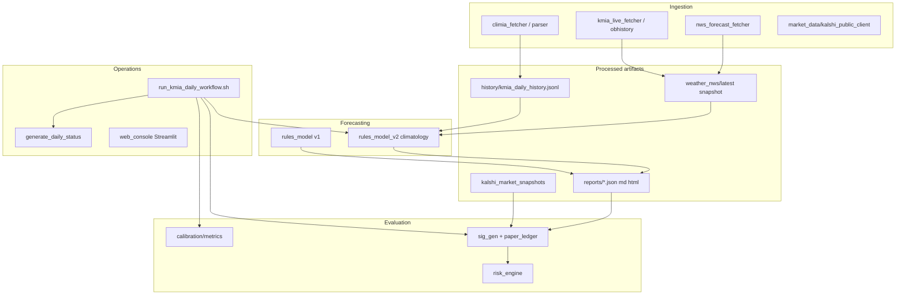

# Refactoring Plan — KMIA Kalshi Predictor

**Status:** Phases 0–4 complete. Phase 7 governance contract published (`AGENTS.md`). Phases 5–6 deferred.  
**Baseline:** `bash scripts/run_tests.sh` — all tests passing (2026-05-19)  
**Scope:** Tighter code structure and governance. **No real-money trading.**

This document is the single source of truth for refactor sequencing. Work phase-by-phase; do not skip guardrails.

---

## Goals

1. **One canonical implementation** per concern (bins, Kalshi client, paper ledger, edge/EV).
2. **Predictable imports** — `PYTHONPATH=backend/src`, no `sys.path` hacks, no `from src.*`.
3. **Clear persistence model** — files for ops artifacts; DB optional for historical analytics.
4. **Enforceable governance** — automated invariants + existing safety greps.
5. **Deep modules** — merge shallow pass-through layers where the deletion test fails.

---

## Non-goals (MVP lockdown)

- Real order placement or authenticated trading APIs.
- Multi-station or non-weather markets.
- React frontend.
- Changing `REQUIRED_BINS` without architecture review ([MVP_LOCKDOWN.md](MVP_LOCKDOWN.md)).

---

## System map (current)

---

## Known duplication (consolidation targets)

| Concern | Canonical owner (target) | Duplicates to merge/retire |
|--------|---------------------------|----------------------------|
| Temperature bins | `shared/types.REQUIRED_BINS` | ~~duplicates~~ consolidated (Phase 0) |
| Kalshi HTTP client | `market_data/kalshi_public_client` | `kalshi/client.py` (different base URL) |
| Edge / EV math | `trading/edge_engine` (paper path) | `recommendation/ev` (recommendation path) — unify interface |
| Paper ledger | `paper_trading/paper_ledger` + `artifact_paths.PAPER_LEDGER_FILE` | `persistence.py` (`paper_trades.jsonl`), `learning.py` (`paper_trade_ledger.jsonl`) |
| Domain types | `shared/types` (Pydantic) | SQLAlchemy `db/models` — rename ORM models to `*Record` to avoid collision |
| Weather fetch | `ingestion/*` | `weather/nws_kmia_client` wrapper — fold into ingestion facade |
| Latest-file selection | `shared/timestamp_utils` | `web_console.latest_file` (mtime) vs signal_generator (embedded ts) |

---

## Phases

### Phase 0 — Guardrails & baseline (START HERE)

**Objective:** Make refactor safe and measurable.

| ID | Task | Status |
|----|------|--------|
| 0.1 | This plan + ADR-0001 | Done |
| 0.2 | Test baseline recorded in ADR | Done |
| 0.3 | `REQUIRED_BINS` single definition + invariant test | Done |
| 0.4 | Safety grep stays in CI / `run_tests.sh` | Existing |
| 0.5 | Document canonical artifact paths (`shared/artifact_paths`) | Existing |
| 0.6 | Add `docs/adr/` for refactor decisions | Done |

**Exit criteria:** All tests pass; invariant tests pass; no new forbidden trading terms.

---

### Phase 1 — Import hygiene & package boundaries

| ID | Task | Status |
|----|------|--------|
| 1.1 | Remove `sys.path.insert` from `run_daily_prediction.py`, `settlement_check.py`, `jobs.py` | Done |
| 1.2 | Replace all `from src.X` with bare imports under `backend/src` and `backend/tests` | Done |
| 1.3 | Remove silent `try/except ImportError` mocks in `weather/nws_kmia_client.py` | Done |
| 1.4 | Fix test patch targets that pointed at non-canonical `src.X` module paths | Done |
| 1.5 | Add invariant tests: no `from src.` in src/tests, no `sys.path` in src | Done |
| 1.6 | Single entry convention: `python -m scheduler.run_daily_prediction` with `PYTHONPATH=backend/src` | Done |
| 1.7 | Add `backend/src/kmia/` package root (optional) — deferred, no value yet | Deferred |

**Exit criteria:** Grep shows zero `from src.` in `backend/src` and `backend/tests`; dry-run workflow unchanged. Invariant tests in suite. ✅

**Latent bug fixed during Phase 1:** `weather/nws_kmia_client.py` previously had `try/except ImportError` that silently substituted mock functions when `from src.ingestion.X` failed (which it did under the canonical `PYTHONPATH=backend/src` setup). Tests appeared to mock network calls correctly but actually targeted a different module object. Fixed by using real imports and correcting patch targets.

---

### Phase 2 — Consolidate duplicates (behavior-preserving)

| ID | Task | Status |
|----|------|--------|
| 2.1 | Deprecate `kalshi/client.py`; redirect tests to `market_data`; canonical `get_markets`/`get_events` added | Done |
| 2.2 | Unify edge/EV behind `trading/edge_engine`; `recommendation/ev` becomes a thin re-export shim | Done |
| 2.3 | Single paper ledger path (`ledger.json`); legacy `paper_trade_ledger.jsonl` readers migrated to `PaperLedger` | Done |
| 2.4 | Rename SQLAlchemy models to `*Record` suffix to disambiguate from Pydantic types | Done |
| 2.5 | Extract `run_daily_prediction` feature assembly → `features/pipeline_inputs.py` | Done |

**Exit criteria:** Tests pass; daily workflow script smoke-run with byte-identical forecast output; docs updated. (Verified 2026-05-19.)

**Bonus fixes during Phase 2:**

- `kalshi/client.py` is now a deprecation shim emitting `DeprecationWarning`; eliminates URL split-brain.
- Latent `NameError` in scheduler (when NWS snapshot missing, `thunderstorm_severity` was undefined) fixed by giving it an explicit default in `CLIMATOLOGICAL_DEFAULTS`.
- Latent `open_paper_trades` count bug fixed: legacy reader counted *all* trades (including settled) via line-count of a non-existent JSONL; new path counts open trades only via `PaperLedger.count_open_trades()`.
- Kalshi fee formula (`0.07 * p * (1 - p)`) now has exactly one inline copy across the codebase (in `trading/edge_engine.calculate_kalshi_fee`).
- Dead ORM imports removed from `scheduler/jobs.py` (only `LiveObservation` is actually used).
- New invariants:
  - `test_single_kalshi_public_client_definition`
  - `test_no_paper_trade_ledger_jsonl_reference_in_paper_trading`
  - `test_single_kalshi_fee_formula_definition`
  - `test_orm_models_use_record_suffix`

---

### Phase 3 — Deepen modules (delete shallow layers)

| ID | Task | Status |
|----|------|--------|
| 3.1 | Split `web_console.py` (~1.7k lines) into `console/pages/*` + shared loaders | Done |
| 3.2 | Merge `weather/nws_kmia_client` into ingestion orchestrator | Done |
| 3.3 | Wire or explicitly defer LLM review in pipeline (config flag) | Done |
| 3.4 | `jsonl_store` file locking or SQLite for paper history | Done |

**Exit criteria:** No file > ~400 lines without documented reason; interface tests at module boundaries.

**Phase 3.1 — web_console.py split (completed 2026-05-19):**

- New `console/` package houses the dashboard:
  - `console/data_helpers.py` — all pure helpers (file IO, formatters, domain extractors). The only Streamlit-aware function is `safe_dataframe`.
  - `console/pages/<tab>.py` — one focused module per tab: `command_center`, `kalshi_market`, `active_forecasts`, `paper_trading`, `weather`, `calibration`, `backtesting`, `system_health`.
- `web_console.py` shrinks from 1735 → ~420 lines. It now owns only Streamlit page config, the centralized data-loading + state derivation block, the sidebar, and tab dispatch. All helper and renderer names are re-exported at module scope so existing test imports (`from web_console import format_temp`, etc.) keep working.
- New invariant `test_render_functions_live_under_console_pages_only` prevents `render_*` tab functions from being redefined outside `console/pages/`. The Streamlit auto-discovered multipage directory at `backend/src/pages/` is explicitly exempted (those modules own their own internal helpers).

**Phase 3 batch completed 2026-05-19:**

- **3.2** — `NWSKMIAClient` moved to canonical `ingestion/weather_status_writer.py`; `weather/nws_kmia_client.py` becomes a deprecation shim that re-exports the class and the underlying `fetch_*` functions so legacy patch paths keep working. `scripts/check_weather_ingestion.sh` now `export`s `PYTHONPATH` (was a silent no-op) and invokes the canonical module via `python -m ingestion.weather_status_writer`.
- **3.3** — `shared/feature_flags.py` introduced as the single source of truth for opt-in runtime features; `LLM_REVIEW_ENABLED` defaults to OFF with env-var override (`KMIA_LLM_REVIEW_ENABLED=1`). `llm/llm_reviewer.py` docstring now states the deferral plainly and points at the flag and validator contract.
- **3.4** — `storage/jsonl_store.py` rewritten with POSIX `fcntl` advisory locks (exclusive on write, shared on read) and read-modify-write atomicity for `update_record`. Verified with a concurrent-writer characterization test that two spawn-mode subprocesses appending 50 records each produce 100 intact, non-torn JSON lines.
- **Test runner hygiene** — `run_tests.py` now guards its test loop under `if __name__ == "__main__"` so multiprocessing workers (spawn) no longer re-execute the whole suite when a test launches a subprocess.

### Phase 4 — Decompose signal generator (completed 2026-05-19)

| ID | Task | Status |
|----|------|--------|
| 4.1 | Extract per-market signal-build logic from `paper_trading/signal_generator.py` | Done |
| 4.2 | Extract forecast-loading + distribution-resolution helpers | Done |
| 4.3 | Add invariants + characterization tests for the new helpers | Done |

**Why this matters.** `generate_paper_signal` had grown to a ~445-line orchestrator: nested per-event-date and per-market loops, two duplicated direct-lookup blocks against `model_bins`, two near-identical signal-dict construction paths, and a 30-line action-decision block buried inside the inner loop. Every paper trade we evaluate flows through this code, and the density made it hard to reason about whether the weather gate, the risk engine, or the stale-market check would win in an ambiguous case.

**What changed.** Six pure helpers, each individually unit-tested:

- `_extract_market_pricing(market, orderbook)` — encodes the dollar/cent/orderbook fallback chain for YES ask/bid/last.
- `_resolve_model_probability_from_bins(model_bins, bin_str)` — single source of truth for the normalized-key direct lookup; returns `None` only when the bin is genuinely absent (distinguishable from a present-but-zero probability).
- `_build_contract_probability_payload(...)` — assembles the `contract_prob_payload` dict, with a documented priority order (distribution mapper → stub → direct-bin override) and explicit stale-market handling.
- `_decide_paper_action(edge, is_stale, risk_decision, weather_gate)` — codifies the five-rung action ladder (`NO SIGNAL → NO TRADE → PAPER BUY CANDIDATE → WATCH → NO EDGE`) with the weather gate as a strict fail-closed override.
- `_load_event_forecast(...)` — resolves the forecast artifact for an event date, handling JSON vs MD, override paths, corrupt files, and date-mismatch warnings.
- `_resolve_temp_distribution(...)` — picks the 1°F integer distribution (preferring the forecast's own field over a reconstruction from coarse bins).

After the extractions, `generate_paper_signal` itself dropped from ~445 lines to ~325 lines, and the per-market loop body became flat enough to scan in one read.

**Guardrails added.**

- `test_signal_generator_helpers_remain_module_level` — fails if any of the six helpers is deleted or inlined.
- `test_generate_paper_signal_stays_under_size_budget` — fails if the orchestrator function exceeds 400 source lines.
- `test_signal_generator_helpers.py` — 27 unit tests covering each helper's contract, including the subtle “present-but-zero vs missing” distinction, the orderbook-override priority, and the weather-gate fail-closed override.

**Verification.** Full test suite green (`run_tests.py`), and a live `generate_paper_signal()` invocation against the current artifacts produced the same 12-signal report across two event dates with the safety block intact.

### Phase 7 — Governance contract (completed 2026-05-19)

| ID | Task | Status |
|----|------|--------|
| 7.1 | Publish `AGENTS.md` at repo root with canonical-module table, gating commands, and non-negotiable rules | Done |
| 7.2 | Add invariant pinning `AGENTS.md` existence + canonical-module references | Done |
| 7.3 | Add invariant enforcing the `safety` block (`no_real_trading: True`, `no_order_execution: True`) in the paper signal report | Done |

`AGENTS.md` is now the entry contract for any future agent (human or AI)
picking up work in this repository. It captures the five non-negotiable
rules, the canonical-module table (where the single source of truth
lives for each concern), the ship-a-change workflow, and the "things
you should NOT do without explicit instruction" list (LLM wiring,
adding stations, replacing file persistence, real-trading paths). The
`test_agents_md_exists_and_lists_canonical_modules` invariant ensures
the contract stays aligned with the code — if you move a module to a
new canonical location, the test fails until `AGENTS.md` is updated.

### Phases 5–6 — Deferred candidates (not started)

| ID | Task | Status |
|----|------|--------|
| 5 | Decompose `paper_trading/settlement.py` (572 lines, ~200-line `settle_paper_trades` monolith) using the same helper-extraction pattern as Phase 4 | Deferred |
| 6 | Split `market_data/kalshi_contract_mapper.py` (559 lines) into a parser and a mapper, each independently testable | Deferred |

Both are well-bounded continuations of the same playbook; the next
agent can pick either one with `AGENTS.md` and the existing invariants
as guardrails.

---

## How to work each PR

1. Pick one phase row; one concern per PR.
2. Run `bash scripts/run_tests.sh`.
3. Run safety grep from [DAILY_OPERATIONS_CHECKLIST.md](DAILY_OPERATIONS_CHECKLIST.md).
4. Update this table’s Status column.
5. Add ADR if the decision is non-obvious.

---

## References

- **[REFACTORING_DEEP_DIVE.md](REFACTORING_DEEP_DIVE.md)** — how to refactor (architecture, duplication, PR order)
- [full_project_review.md](full_project_review.md) — P0–P3 audit (2026-05-03)
- [CODE_GOVERNANCE.md](../CODE_GOVERNANCE.md)
- [MVP_LOCKDOWN.md](MVP_LOCKDOWN.md)
- [REAL_TRADING_GATE.md](REAL_TRADING_GATE.md)
- [.cursor/rules/english-only.mdc](../.cursor/rules/english-only.mdc)
