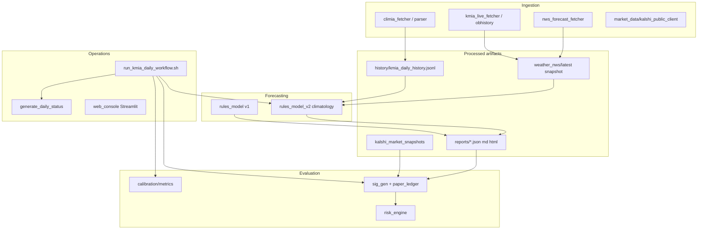

# Refactoring Plan — KMIA Kalshi Predictor

**Status:** Phase 1 complete — see [REFACTORING_DEEP_DIVE.md](REFACTORING_DEEP_DIVE.md) for full analysis  
**Baseline:** `bash scripts/run_tests.sh` — all tests passing (2026-05-19)  
**Scope:** Tighter code structure and governance. **No real-money trading.**

This document is the single source of truth for refactor sequencing. Work phase-by-phase; do not skip guardrails.

---

## Goals

1. **One canonical implementation** per concern (bins, Kalshi client, paper ledger, edge/EV).
2. **Predictable imports** — `PYTHONPATH=backend/src`, no `sys.path` hacks, no `from src.*`.
3. **Clear persistence model** — files for ops artifacts; DB optional for historical analytics.
4. **Enforceable governance** — automated invariants + existing safety greps.
5. **Deep modules** — merge shallow pass-through layers where the deletion test fails.

---

## Non-goals (MVP lockdown)

- Real order placement or authenticated trading APIs.
- Multi-station or non-weather markets.
- React frontend.
- Changing `REQUIRED_BINS` without architecture review ([MVP_LOCKDOWN.md](MVP_LOCKDOWN.md)).

---

## System map (current)

---

## Known duplication (consolidation targets)

| Concern | Canonical owner (target) | Duplicates to merge/retire |
|--------|---------------------------|----------------------------|
| Temperature bins | `shared/types.REQUIRED_BINS` | ~~duplicates~~ consolidated (Phase 0) |
| Kalshi HTTP client | `market_data/kalshi_public_client` | `kalshi/client.py` (different base URL) |
| Edge / EV math | `trading/edge_engine` (paper path) | `recommendation/ev` (recommendation path) — unify interface |
| Paper ledger | `paper_trading/paper_ledger` + `artifact_paths.PAPER_LEDGER_FILE` | `persistence.py` (`paper_trades.jsonl`), `learning.py` (`paper_trade_ledger.jsonl`) |
| Domain types | `shared/types` (Pydantic) | SQLAlchemy `db/models` — rename ORM models to `*Record` to avoid collision |
| Weather fetch | `ingestion/*` | `weather/nws_kmia_client` wrapper — fold into ingestion facade |
| Latest-file selection | `shared/timestamp_utils` | `web_console.latest_file` (mtime) vs signal_generator (embedded ts) |

---

## Phases

### Phase 0 — Guardrails & baseline (START HERE)

**Objective:** Make refactor safe and measurable.

| ID | Task | Status |
|----|------|--------|
| 0.1 | This plan + ADR-0001 | Done |
| 0.2 | Test baseline recorded in ADR | Done |
| 0.3 | `REQUIRED_BINS` single definition + invariant test | Done |
| 0.4 | Safety grep stays in CI / `run_tests.sh` | Existing |
| 0.5 | Document canonical artifact paths (`shared/artifact_paths`) | Existing |
| 0.6 | Add `docs/adr/` for refactor decisions | Done |

**Exit criteria:** All tests pass; invariant tests pass; no new forbidden trading terms.

---

### Phase 1 — Import hygiene & package boundaries

| ID | Task | Status |
|----|------|--------|
| 1.1 | Remove `sys.path.insert` from `run_daily_prediction.py`, `settlement_check.py`, `jobs.py` | Done |
| 1.2 | Replace all `from src.X` with bare imports under `backend/src` and `backend/tests` | Done |
| 1.3 | Remove silent `try/except ImportError` mocks in `weather/nws_kmia_client.py` | Done |
| 1.4 | Fix test patch targets that pointed at non-canonical `src.X` module paths | Done |
| 1.5 | Add invariant tests: no `from src.` in src/tests, no `sys.path` in src | Done |
| 1.6 | Single entry convention: `python -m scheduler.run_daily_prediction` with `PYTHONPATH=backend/src` | Done |
| 1.7 | Add `backend/src/kmia/` package root (optional) — deferred, no value yet | Deferred |

**Exit criteria:** Grep shows zero `from src.` in `backend/src` and `backend/tests`; dry-run workflow unchanged. Invariant tests in suite. ✅

**Latent bug fixed during Phase 1:** `weather/nws_kmia_client.py` previously had `try/except ImportError` that silently substituted mock functions when `from src.ingestion.X` failed (which it did under the canonical `PYTHONPATH=backend/src` setup). Tests appeared to mock network calls correctly but actually targeted a different module object. Fixed by using real imports and correcting patch targets.

---

### Phase 2 — Consolidate duplicates (behavior-preserving)

| ID | Task | Status |
|----|------|--------|
| 2.1 | Deprecate `kalshi/client.py`; redirect tests to `market_data`; canonical `get_markets`/`get_events` added | Done |
| 2.2 | Unify edge/EV behind one module; thin wrappers in `recommendation/` | Pending |
| 2.3 | Single paper ledger path (`ledger.json`); migrate readers off JSONL variants | Pending |
| 2.4 | Rename SQLAlchemy models: `DailyPredictionRecord`, etc. | Pending |
| 2.5 | Extract `run_daily_prediction` feature assembly → `features/pipeline_inputs.py` | Done |

**Exit criteria:** Tests pass; daily workflow script smoke-run with byte-identical forecast output; docs updated. (2.1 + 2.5 verified 2026-05-19.)

**Bonus fixes during Phase 2:**

- `kalshi/client.py` is now a deprecation shim emitting `DeprecationWarning`; eliminates URL split-brain.
- Latent `NameError` in scheduler (when NWS snapshot missing, `thunderstorm_severity` was undefined) fixed by giving it an explicit default in `CLIMATOLOGICAL_DEFAULTS`.
- New invariant: `test_single_kalshi_public_client_definition`.

---

### Phase 3 — Deepen modules (delete shallow layers)

| ID | Task |
|----|------|
| 3.1 | Split `web_console.py` (~1.7k lines) into `console/pages/*` + shared loaders |
| 3.2 | Merge `weather/nws_kmia_client` into ingestion orchestrator |
| 3.3 | Wire or explicitly defer LLM review in pipeline (config flag) |
| 3.4 | `jsonl_store` file locking or SQLite for paper history |

**Exit criteria:** No file > ~400 lines without documented reason; interface tests at module boundaries.

---

## How to work each PR

1. Pick one phase row; one concern per PR.
2. Run `bash scripts/run_tests.sh`.
3. Run safety grep from [DAILY_OPERATIONS_CHECKLIST.md](DAILY_OPERATIONS_CHECKLIST.md).
4. Update this table’s Status column.
5. Add ADR if the decision is non-obvious.

---

## References

- **[REFACTORING_DEEP_DIVE.md](REFACTORING_DEEP_DIVE.md)** — how to refactor (architecture, duplication, PR order)
- [full_project_review.md](full_project_review.md) — P0–P3 audit (2026-05-03)
- [CODE_GOVERNANCE.md](../CODE_GOVERNANCE.md)
- [MVP_LOCKDOWN.md](MVP_LOCKDOWN.md)
- [REAL_TRADING_GATE.md](REAL_TRADING_GATE.md)
- [.cursor/rules/english-only.mdc](../.cursor/rules/english-only.mdc)
